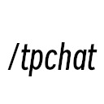
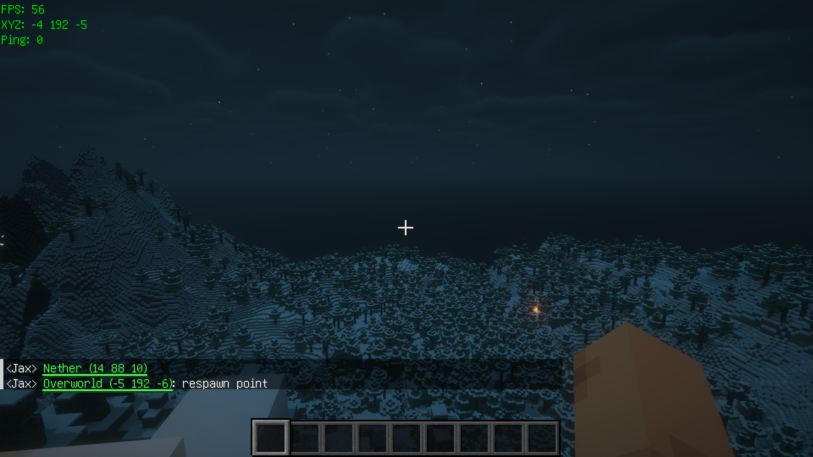

<div>
  
  <h1>TP Chat Command</h1>
</div>

 
 
 
 

This is a simple client Fabric mod for Minecraft. It provides a
command called `/tpchat`, which has a simlar syntax to the
vanalia `/tp` command. You can use it to send clickable message
to **EVERY ONLINE PLAYER** for teleporting. And it can be used to teleport
between dimensions, e.g., overworld <-> nether.



## Usage

Syntax: `/tpchat [<location>] [<description>]`.

Notice: You must have `/tellraw` command permission to execute
this command. Because `/tpchat` is technically a
[wrapper command](#development) of `/tellraw`.

Examples:

- `/tpchat`: Send a clickable message for teleporting to current
  location.

- `/tpchat x y z`: Send a clickable message for teleporting to
  `(x,y,z)`.

- `/tpchat ~ ~ ~ Hello, World!`: Send a clickable message for
  teleporting to current location with a custom description.

## Development

`/tpchat` is completely a client-side mod, because it is only a
wrapper command of `/tellraw`. There's no need to installed it
on server side. You can use it on any server as long as you have
`/tellraw` command permission.

Actually, when you use `/tpchat`, something like this will be
executed:

```json
/tellraw @a ["<Player> ",{"text":"Nether (9 60 -2)","color":"green","underlined":true,"clickEvent":{"action":"run_command","value":"/execute in minecraft:the_nether run tp @s 9 60 -2"}},": Hello, World!"]
```

## Limitation

Because of dedicated server's packet size limit, `/tpchat`'s
description has a length limit. Details see [Cannot send too long message to dedicated server · Issue #5 · jaxvanyang/tp-chat-cmd](https://github.com/jaxvanyang/tp-chat-cmd/issues/5).

## Acknowledgement

- [Fabric](https://fabricmc.net) - Thanks for the wonderful
  framework, documents and community.
- [得意黑 Smiley Sans](https://atelier-anchor.com/typefaces/smiley-sans) - Thanks for the awesome font, it is used in the icon.
- [VueTorrent](https://github.com/WDaan/VueTorrent) - Thanks for
  the README title template.
